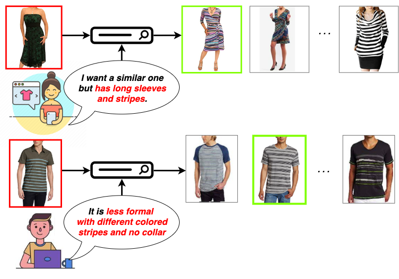

# Image Retrieval with Text Feedback based on Transformer Deep Model
This is the code for the paper:

**<a href="https://drive.google.com/file/d/1DUIUwfjqGLrlfTeD1-8VDT2-pUSvI7ZH/view?usp=sharing">Image Retrieval with Text Feedback based on Transformer Deep Model
</a>**
<br>
Truc Luong-Phuong Huynh, Ngoc Quoc Ly
<br>
***NAFOSTED Conference on Information and Computer Science (NICS) 2021.***


If you find this code useful in your research then please cite

```
@inproceedings{huynh2021image,
  title={Image Retrieval with Text Feedback based on Transformer Deep Model},
  author={Truc, Huynh and Ngoc, Ly},
  booktitle={NICS},
  year={2021}
}
```

## Introduction
Image retrieval with text feedback has many potentials when applied in product retrieval for e-commerce platforms. Given an input image and text feedback, the system needs to retrieve images that not only look *visually similar* to the input image but also have *some modified details* mentioned in the text feedback. This is a tricky task as it requires a good understanding of image, text, and also their combination. 


*Examples of customers using image retrieval with text feedback in a fashion e-commerce application.*

In this paper, we propose a novel framework called **Image-Text Modify Attention (ITMA)** and **a Transformer-based combining function** that performs *preservation* and *transformation* features of the input image based on the text feedback and *captures important* features of database images. By using multiple image features at **different Convolution Neural Network (CNN) depths**, the combining function can have *multi-level* visual information to achieve an *impressive* representation that satisfies for effective image retrieval.


An overview of the training pipeline.

We conduct quantitative and qualitative experiments on two datasets: **CSS** and **FashionIQ**. ITMA *outperforms existing approaches* on these datasets and can deal with various types of text feedback such as *object attributes* and *natural language*. We are also the *first ones* to discover the **exceptional behavior of the attention mechanism** in this task which ignores input image regions where text feedback wants to *remove* or *change*.


## Setup

The code is tested on Python 3.6 with PyTorch 1.5 and should also work on newer versions. The following can be installed with pip:

- pytorch
- torchvision
- numpy
- tqdm
- tensorboardX
- pillow
- pytorch_pretrained_bert
- gitpython

## Datasets

We do not own any of the datasets used in our experiments here. Below we link to the datasets where we acquired them.

### Fashion IQ

Download the dataset from [here](https://github.com/XiaoxiaoGuo/fashion-iq).

### CSS3D dataset

Download the dataset from this [external website](https://drive.google.com/file/d/1wPqMw-HKmXUG2qTgYBiTNUnjz83hA2tY/view?usp=sharing).

Make sure the dataset includes these files:
`<dataset_path>/css_toy_dataset_novel2_small.dup.npy`
`<dataset_path>/images/*.png`

### MITStates dataset
Download the dataset from this [external website](http://web.mit.edu/phillipi/Public/states_and_transformations/index.html).

Make sure the dataset include these files:

`<dataset_path>/images/<adj noun>/*.jpg`


### Fashion200k dataset
Download the dataset from this [external website](https://github.com/xthan/fashion-200k) Download our generated test_queries.txt from [here](https://storage.googleapis.com/image_retrieval_css/test_queries.txt).

Make sure the dataset include these files:

```
<dataset_path>/labels/*.txt
<dataset_path>/women/<category>/<caption>/<id>/*.jpeg
<dataset_path>/test_queries.txt`
```


## Notes:
All log files will be saved at `./runs/<timestamp><comment>`.
Monitor with tensorboard (training loss, training retrieval performance, testing retrieval performance):

```tensorboard --logdir ./runs/ --port 8888```

Pytorch's data loader might consume a lot of memory, if that's an issue add `--loader_num_workers=0` to disable loading data in parallel.
